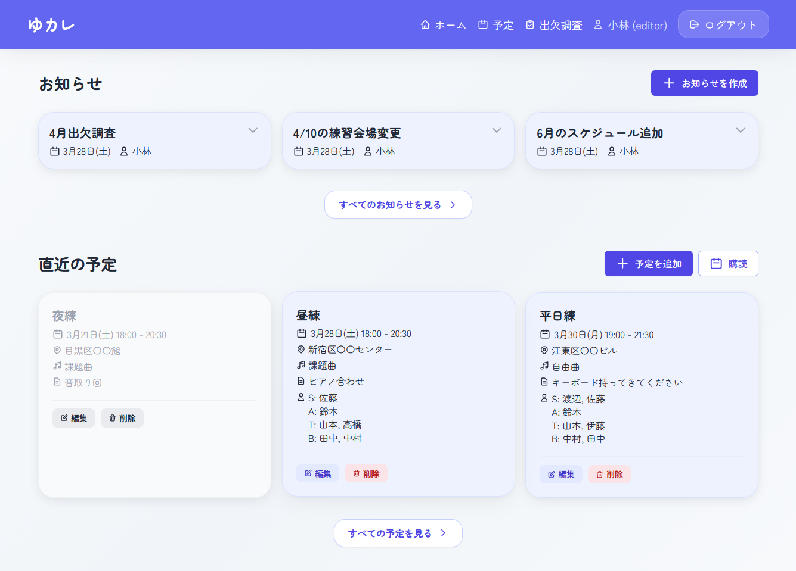

# Yucale - スケジュール共有サービス

ユーザーが共有カレンダーを確認・編集できるWebアプリケーションです。
スケジュール情報はICS形式で生成され、外部カレンダーアプリでの購読もサポートします。

## 機能

### ユーザー認証
- ユーザー登録 / ログイン / ログアウト
- ロールベースアクセス制御 (NO_ROLE, VIEWER, EDITOR, ADMIN)
- 権限リクエスト機能
- ユーザー名変更

### スケジュール管理
- スケジュールの作成・編集・削除
- スケジュール一覧表示
- 終日イベント対応

### お知らせ機能
- お知らせの作成・編集・削除
- お知らせ一覧表示

### 出欠調査機能
- スケジュールに紐づく出欠調査の作成・編集・削除
- 回答結果の集計・表示
- URLでの出欠調査共有 (非ログインユーザーも回答可能)

### ICSファイル配信
- 管理者が指定したURLからICSファイルをダウンロード可能
- Google Calendar, Apple Calendar等でカレンダーを購読可能

### 管理機能
- 権限リクエストの承認・拒否
- ユーザー管理（一覧表示・削除）
- Discord Webhook通知

## ユーザーロール

| ロール | 権限 |
|--------|------|
| 非ログイン | 直近のスケジュールの概要表示（タイトルと日付）、出欠調査への回答 |
| NO_ROLE | 非ログインの権限 + 出欠調査回答の更新 |
| VIEWER | NO_ROLEの権限 + スケジュールの詳細・一覧表示、お知らせ表示 |
| EDITOR | VIEWERの権限 + スケジュール・お知らせ・出欠調査の作成・編集・削除、出欠調査結果の表示 |
| ADMIN | EDITORの権限 + ユーザー管理・権限管理 |

## 開発者向け情報

開発環境のセットアップ、APIエンドポイント、テスト、デプロイなどの技術的な詳細は [developer.md](developer.md) を参照してください。

## ライセンス

MIT License

## 貢献

1. Fork
2. Feature branch作成 (`git checkout -b feature/amazing-feature`)
3. 変更をコミット (`git commit -m 'Add amazing feature'`)
4. Push (`git push origin feature/amazing-feature`)
5. Pull Request作成
